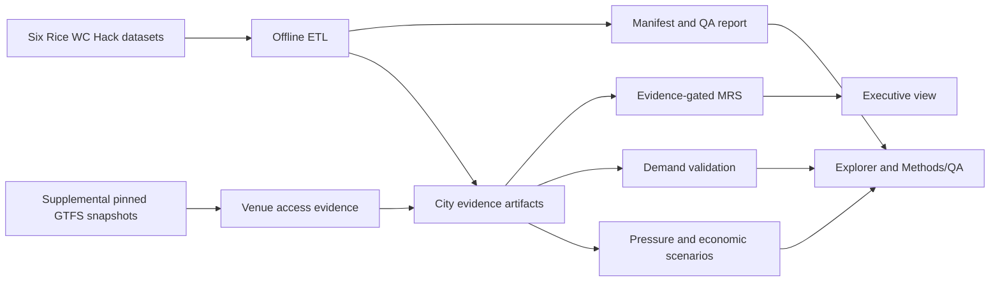

# Platform methodology

The platform separates source evidence, derived metrics, and intervention
scenarios. Raw data stay local; only compact artifacts enter the dashboard.

## Evidence lifecycle

1. **Ingest**: resolve `MOBILITY_DATA_ROOT`, enumerate expected partitions, and
   read raw files in bounded chunks.
2. **Validate**: record required columns, duplicate keys, date parsing,
   numeric ranges, coordinates, nulls, sentinels, and canonical market values.
3. **Aggregate**: write deterministic Parquet artifacts with row counts and
   SHA-256 hashes. Combined markets are explicitly allocated and marked
   partial.
4. **Score**: calculate venue-centered transit, heat, UHI, and POI-support
   components. A partial MRS can be inspected but is not rankable by default.
5. **Scenario-test**: expose assumptions for demand uplift, shuttle capacity,
   mode shift, emissions, and commercial activity. Scenario values are not
   relabeled as observed outcomes.
6. **Audit**: the Methods & QA view exposes coverage, formulas, validation
   results, assumptions, and downloads for the numbers shown elsewhere.

## Release decision rule

The default Executive view uses the `rice_supplied_data` profile: 35% heat,
25% UHI, 40% venue support, and 0% transit. This allows the supplied collection
to support a transparent comparison while the interface explicitly says that
transit is excluded. Transit-weighted profiles remain available and rank only
cities whose non-zero-weight components have observed or derived evidence. A
missing GTFS feed, incomplete weather/POI/UHI artifact, or estimated-only
component stays visible with its status and lowers the rankable count; it does
not become a silent fallback.
