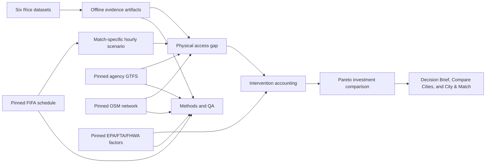

# Transportation decision methodology

## Status and intended decision

Contract `0.3.0` and the integrated application provide match-specific planning
for the 11 US host cities. The six Rice datasets remain canonical context; the
pinned FIFA schedule, eligible GTFS, five-mile OpenStreetMap graphs, strict
factor registry, physical access gaps, and city-specific intervention outcomes
are connected through compact cache-only artifacts.

The release is intended to answer: **where is the access gap, why does it
exist, which package addresses it, what modeled range results, at what planning
cost and lead time, and with what evidence quality?**

## Evidence lifecycle

1. **Pin sources offline.** Every supplemental input uses `SourceReference`
   with publisher, URL, retrieval time, version, license, coverage, status, and
   SHA-256. Dashboard startup performs no network or raw-data reads.
2. **Build match scenarios.** `MatchEvent` provides local kickoff and venue.
   `MovementScenario` reconciles low/base/high attendance to hourly arrivals
   and departures. Rice activity informs context, not match attendance.
3. **Measure the planning gap.** `AccessGapResult` compares scenario peak
   passengers with a range of scheduled transit capacity. It also reports
   network walk distance, post-match service span, and route heat exposure.
4. **Account for interventions.** Packages model shuttle service, additional
   transit, park-and-ride, bike/micromobility, cooled walking corridors, and
   arrival spreading. Added service emissions and upstream driving remain in
   the calculation.
5. **Compare tradeoffs.** Recommendations show gap resolved, cost per passenger,
   net CO2e, lead time, owner, dependencies, and evidence quality. They form a
   Pareto comparison, not an unsupported universal optimum.
6. **Audit the claim.** A metric is presentation-ready only after its field,
   artifact status, source record, formula, and release test all pass.

## City comparison and time horizons

- The strict transportation rank includes only cities whose selected components
  use eligible observed or derived evidence.
- The all-city screening order uses every available numeric value, including
  visibly partial evidence. Its low/high range lets each non-strict component
  vary from 0 to 100; this is an evidence-eligibility bound, not a confidence
  interval and not a substitute for missing data.
- Match, city-tournament, and U.S.-tournament ledgers default to capacity-qualified
  access results. Users may explicitly opt into partial screening totals.
- Park-and-ride, bike hubs, and cooled corridors are treated as one-time capital
  per city. Shuttle, added service, and arrival management recur per event.
- Every recommendation retains its exact `city` and `match_id`; the interface
  does not assign citywide recommendations to whichever match happens to be selected.

## Movement and validation

- Official local kickoff time anchors the event window.
- Attendance and arrival profiles are editable planning ranges.
- Hourly arrivals and departures must sum to scenario attendance within the
  published tolerance.
- The commercial-activity baseline retains rolling 2023 and 2024 holdouts
  against a 364-day seasonal-naive comparator.
- “Validated baseline” is allowed only where the candidate beats the comparator
  in both holdouts. Otherwise the interface uses “planning scenario.”
- Customer-home-state summaries are descriptive commercial-origin context, not
  ticket-holder origins.

## Access and spatial methods

- Transit supply is inferred from event-valid GTFS departures and explicit
  mode-capacity ranges; it is not observed ridership, crowding, or reliability.
- Walking uses a pinned five-mile OSM network around each venue. Results report
  network distance, straight-line distance, detour ratio, isochrones, and tag
  coverage.
- Missing sidewalk, crossing, or accessibility tags remain unknown. No ADA or
  route-safety certification is produced.
- Rice weather and UHI can characterize heat exposure where coverage is
  eligible; spatial jitter and station distance remain visible limitations.
- The residual gap is a scenario passenger quantity, not roadway congestion.

## Intervention accounting

- Shuttle and added-transit capacity are capped by demand and include operating
  VMT and emissions.
- Park-and-ride preserves driving to remote lots and counts only venue-area VMT
  displaced.
- Bike uptake is distance-limited and capacity-capped.
- Cooled walking investment must change a documented heat/walking outcome or
  remain absent from the release UI.
- Arrival spreading reallocates peak demand to shoulder hours without creating
  emissions savings by itself.
- Net CO2e equals avoided private-vehicle emissions minus added service
  emissions. Negative net benefits are valid and must remain visible.
- Costs are low/base/high order-of-magnitude planning ranges, not bids.

MRS remains a secondary policy index. Transportation-weighted profiles require
eligible transit evidence, and Methods & QA reports weight sensitivity and rank
stability. Physical quantities and evidence status take precedence over rank.

See `SOURCE_REGISTER.md`, `EVIDENCE_TO_CLAIM_MATRIX.md`, and `VALIDATION.md`.
