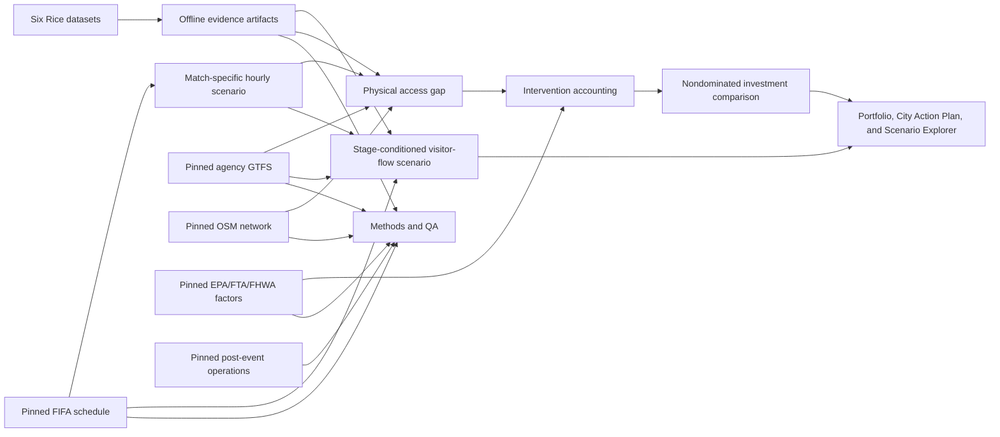

# Transportation decision methodology

## Status and intended decision

Contract `0.3.0` and the integrated application provide match-specific planning
for the 11 US host cities. The six Rice datasets remain canonical context; the
pinned FIFA schedule, eligible GTFS, five-mile OpenStreetMap graphs, strict
factor registry, physical access gaps, and city-specific intervention outcomes
are connected through compact cache-only artifacts.

The release is intended to answer: **where is the access gap, why does it
exist, which defined investment should be screened first, at what scale, what modeled range results, at what planning
cost and lead time, and with what evidence quality?**

## Evidence lifecycle

1. **Pin sources offline.** Every supplemental input uses `SourceReference`
   with publisher, URL, retrieval time, version, license, coverage, status, and
   SHA-256. Dashboard startup performs no network or raw-data reads.
2. **Build match scenarios.** `MatchEvent` provides local kickoff and venue.
   `MovementScenario` reconciles low/base/high attendance to hourly arrivals
   and departures. Rice activity informs context, not match attendance.
3. **Forecast broad visitor flow.** A deterministic scenario allocates every
   official match's attendance to four broad origin types and four broad
   venue-approach modes. Stage, commercial domestic-origin context, transit
   readiness, scheduled peak coverage, and walking evidence change the mix;
   exact origins, routes, and travel times are not inferred.
4. **Measure the planning gap.** `AccessGapResult` compares scenario peak
   passengers with a range of scheduled transit capacity. It also reports
   network walk distance, post-match service span, and route heat exposure.
5. **Account for interventions.** Packages model shuttle service, additional
   transit, park-and-ride, bike/micromobility, cooled walking corridors, and
   arrival spreading. Added service emissions and upstream driving remain in
   the calculation.
6. **Compare tradeoffs.** Recommendations show gap resolved, cost per passenger,
   net CO2e, lead time, owner, dependencies, and evidence quality. They form a
   nondominated comparison, not an unsupported universal optimum.
   The portfolio then applies a visible bottleneck rule to nominate which
   evidence-qualified single measure each host should validate first.
7. **Audit the claim.** A metric is presentation-ready only after its field,
   artifact status, source record, formula, and release test all pass.

## Operational benchmark boundary

The versioned operational snapshot contains 33 official post-event metrics for
all 11 host cities and 13 match-level wide records. Each source
hash covers locally pinned raw HTTP response bytes; each transcription includes
a source locator, unit, granularity, permitted use, and prohibited uses.

These records benchmark systemwide ridership, special-service throughput,
post-match egress, fleet deployment, and implementation scale. They do not
currently modify movement or access results because none supplies the complete
15-minute arrivals, mode share, passenger loads, curb, parking, pedestrian, and
roadway observations required for match-hour calibration. The no-calibration
boundary is enforced by an integration test.

## Environmental replacement rules

Rice remains canonical. A public supplement replaces a Rice row only when the
versioned replacement policy names that city and the Rice row fails a strict
distance or venue-buffer gate. The original Rice frames remain available in the
runtime bundle for audit.

For Miami and New York/New Jersey, NOAA Global Hourly observations from a
station within five miles of the venue replace distant Rice stations. Relative
humidity is derived hourly from air temperature `T` and dew point `Td` using
the Magnus relation:

`RH = 100 × exp(17.625 Td / (243.04 + Td)) / exp(17.625 T / (243.04 + T))`

Daily rows require at least 18 hourly observations. The existing NOAA
Rothfusz heat-index equation and June-July p90 aggregation are then applied.

For Boston, five cloud-masked Landsat 8/9 Collection 2 Level-2 surface-
temperature scenes from 2022-2024 supply the missing venue-buffer UHI evidence:

`scene UHI_p90 = p90(surface temperature within 2 miles) − median(surface temperature 3–8 miles away)`

The reported city value is the median of valid scene results. This is a surface-
temperature anomaly, not air temperature, shade, physiological exposure, or an
ADA/safe-route audit. Public Landsat bytes were accessed through Microsoft
Planetary Computer's public mirror; USGS remains the data publisher.

## City comparison and time horizons

- The strict transportation rank includes only cities whose selected components
  use eligible observed or derived evidence.
- The all-city screening order uses every available numeric value, including
  visibly partial evidence. Its low/high range lets each non-strict component
  vary from 0 to 100; this is an evidence-eligibility bound, not a confidence
  interval and not a substitute for missing data.
- Match, city-tournament, and U.S.-tournament ledgers default to capacity-qualified
  access results. Users may explicitly opt into partial screening totals.
- Park-and-ride, bike hubs, and cooled corridors are treated as one-time capital
  per city. Shuttle, park-and-ride feeder operations, added service, and arrival
  management recur per event.
- Every recommendation retains its exact `city` and `match_id`; the interface
  does not assign citywide recommendations to whichever match happens to be selected.
- Operational and capital package labels stay in the advanced scenario explorer.
  The portfolio compares concrete single measures and treats operating versus
  capital as delivery/cost metadata rather than as the decision itself.

## Movement and validation

- Official local kickoff time anchors the event window.
- Attendance and arrival profiles are editable planning ranges.
- Hourly arrivals and departures must sum to scenario attendance within the
  published tolerance.
- The fixed planning profiles place the base arrival peak one hour before
  kickoff and the base departure peak two hours after kickoff (after the modeled
  match duration). The portfolio reports both directions instead of calling the
  larger combined peak an arrival forecast.
- The commercial-activity baseline retains rolling 2023 and 2024 holdouts
  against a 364-day seasonal-naive comparator.
- “Validated baseline” is allowed only where the candidate beats the comparator
  in both holdouts. Otherwise the interface uses “planning scenario.”
- Customer-home-state summaries are descriptive commercial-origin context, not
  ticket-holder origins.
- The visitor-flow artifact converts attendance into four broad origin types:
  host market, nearby U.S., long-distance U.S., and international/unobserved.
  Domestic proportions use the supplied commercial customer-origin distribution
  only as a context prior. The international scenario increases by tournament
  stage and remains independent of that commercial panel.
- Broad venue-approach mode shares respond deterministically to transit readiness,
  exact-hour scheduled capacity coverage, the residual access gap, and available
  walking-distance evidence. They are scenario allocations, not measured FIFA
  fan behavior or a calibrated mode-choice model.
- All origin and mode rows reconcile exactly to low/base/high attendance. City
  portfolio values sum every hosted match; the peak-timing label uses the match
  with the greatest base non-host-market demand so later-round pressure is not
  hidden by an arbitrary representative group match.
- No artifact supports exact visitor origin zones, origin-destination pairs,
  route choice, transfer choice, travel times, or roadway assignment. Those remain
  explicit future data requirements rather than silently inferred outputs.

## Access and spatial methods

- Transit supply is inferred from event-valid GTFS departures and explicit
  mode-capacity ranges; it is not observed ridership, crowding, or reliability.
- Walking uses a pinned five-mile OSM network around each venue. Results report
  network distance, straight-line distance, detour ratio, isochrones, and tag
  coverage.
- Missing sidewalk, crossing, or accessibility tags remain unknown. No ADA or
  route-safety certification is produced.
- Rice weather and UHI can characterize heat exposure where coverage is
  eligible; spatial jitter and station distance remain visible limitations.
- The residual gap is a scenario passenger quantity, not roadway congestion.
- First/last mile is presented as two venue-side checks: scheduled capacity in
  the exact peak hour and direction, plus one event-relevant stop-to-venue network
  path where available. For arrivals that path is the last mile; for departures
  it is the first mile. It is not an end-to-end origin accessibility or safety audit.

## Resilience sensitivity

The portfolio stress test applies the same transparent shock to each city's
representative match: modeled peak movement increases 10% and scheduled
passenger capacity decreases 20%. Baseline and stressed coverage are capped at
100%, and the remaining stressed gap stays in passengers per hour. This common
sensitivity supports comparison but does not estimate disruption likelihood,
recovery time, or service reliability.

## Intervention accounting

- The Explorer traffic layer compares modeled venue-area vehicle trips at the
  venue. Marker color and its written label show the direction and percentage
  change from the base case; hover ranges use the minimum and maximum outputs
  across the low, base, and high input cases because those named cases are not
  assumed to produce ordered outcome bounds.
- Shuttle and added-transit capacity are capped by demand and include operating
  VMT and emissions.
- Added frequency is evidence-qualified only when a serving event-hour route and
  a capacity-qualified gap are both established. A zero-capacity event cannot be
  converted into a frequency recommendation without a route-specific operating plan.
- Park-and-ride preserves driving to remote lots and counts only venue-area VMT
  displaced. Passenger throughput is capped by explicitly scheduled feeder
  departures; feeder VMT and event operating cost are included.
- Bike uptake is distance-limited and capacity-capped.
- Cooled walking investment must change a documented heat/walking outcome or
  remain absent from the release UI.
- Arrival spreading uses requested share × eligible share × compliance, capped
  by explicit shoulder-period capacity. It reallocates only that feasible amount,
  conserves total arrivals, and creates no vehicle-trip or emissions credit.
- Arrival response and curb throughput are not observed in the supplied data;
  arrival management therefore remains an exploratory sensitivity rather than
  an evidence-qualified headline option.
- Net CO2e equals avoided private-vehicle emissions minus added service
  emissions. Negative net benefits are valid and must remain visible.
- Total costs are low/base/high order-of-magnitude planning ranges, not bids.
  Recommendation comparisons add per-event operations to reusable capital
  divided by explicit event-use assumptions; total cost remains visible.
- Nondominated screening compares resolved gap, lifecycle-comparison cost per
  passenger, net CO2e, lead time, and heat benefit. Evidence-qualified options
  are separated from exploratory sensitivities, and no row is called optimal.

Stable definitions and variable meanings are maintained in
`dashboard/models/equations.py` and rendered in Methods. See
`EQUATIONS.md` and `ASSUMPTIONS.md` for the reviewer-facing versions.

MRS remains a secondary policy index. Transportation-weighted profiles require
eligible transit evidence, and Methods reports weight sensitivity and rank
stability. Physical quantities and evidence status take precedence over rank.

See `SOURCE_REGISTER.md`, `EVIDENCE_TO_CLAIM_MATRIX.md`, and `VALIDATION.md`.
